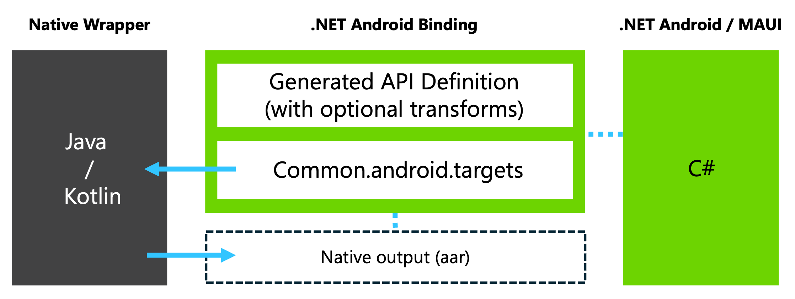
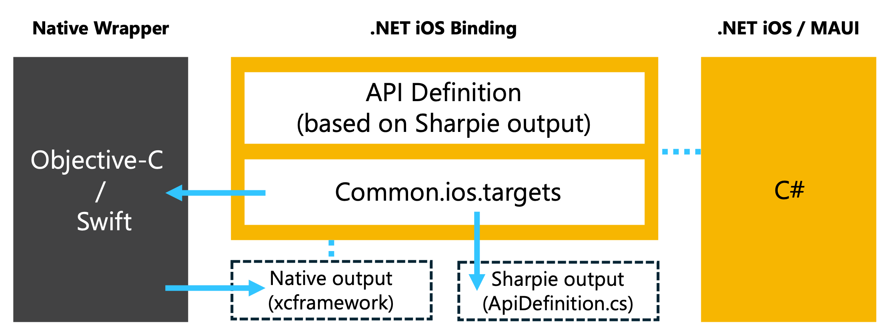

# Slim Bindings for .NET MAUI, iOS and Android

This repository provides a starting point for developers looking to get started with slim bindings. The samples and starting points in this repository demonstrate how to use the [slim binding approach](#slim-binding-approach) to interop with native iOS and Android SDKs from your .NET MAUI apps for iOS and Android, including your .NET iOS apps and .NET Android apps.

## Community Maintained

The long term goal is to move this repository into a community maintained space, (e.g. potentially the CommunityToolkit org) and work with community owners/maintainers to add more samples and expand the slim/wrapper API surface for existing samples based on the community's needs.

## Quick Start

Get started with slim bindings using the Facebook, Firebase Analytics, Firebase Messaging, and Google Cast samples in this repository:

0. Ensure your [environment is set up](#environment-setup).

1. Submodule or clone this repo

2. Navigate to the appropriate folder for the binding you're interested in using or building from <br>
e.g. For Firebase Messaging, navigate to `firebase/macios/Firebase.MaciOS.Binding`

3. Run `dotnet build`

4. Navigate to your .NET MAUI, .NET iOS, or .NET Android app

5. Add a project reference to your MAUI app pointing to the path where you have cloned the repo <br>
e.g. For Firebase Messaging, add to your csproj:
    ```xaml
    <ProjectReference Include="<YourPathToClonedSlimBindingsRepo>\Firebase.MaciOS.Binding\Firebase.MaciOS.Binding.csproj" />
    ```

6. Cross-reference the sample and add the necessary code into your own project. <br>
e.g. For Firebase Messaging, navigate to `firebase/macios/sample` and ensure YourMauiApp.csproj reflects the unique contents in `firebase/macios/sample/Sample.csproj` such as the following:

    ```xaml
    <BundleResource Include="Platforms\iOS\GoogleService-Info.plist">
        <Link>GoogleService-Info.plist</Link>
    </BundleResource>
    ```
    ```xaml
    <ItemGroup>
        <CustomEntitlements Include="aps-environment" Type="string" Value="development" Condition="'$(Configuration)' == 'Debug'" />
        <CustomEntitlements Include="aps-environment" Type="string" Value="production" Condition="'$(Configuration)' == 'Release'" />
    </ItemGroup>
    ```

7. Ensure YourMauiApp/Platforms files reflects the contents of the files in `firebase/macios/sample/Platforms` such as in the AppDelegate.cs, Info.plist, and GoogleService-Info.plist files.

8. Use the slim binding in your .NET MAUI app! See sample usage in the `Sample` .NET MAUI apps included in each of the subfolders.

Keep reading for more context on [Building](#building). Guidance will continue to be updated in this repository.

## Slim Binding Approach

Slim binding refers to a pattern for accessing native SDKs in .NET apps indirectly via a "thin" wrapper with a simplified API surface. This approach is especially beneficial when you only need a small slice of the API surface of the SDK, though it also works well for larger API surface usage all the same.

The idea is to create your own abstraction or "wrapper" API to the native SDK's you're interested in calling from .NET. The native "wrapper" library/framework projects get created in Android Studio using Java/Kotlin and/or Xcode Objective-C/Swift. The implementation of this wrapper API would typically follow the SDK documentation which is likely easier to follow and apply when using the same language as the documentation. It may even be possible to copy and paste code from the vendor documentation directly. 

A key benefit of slim bindings is based on the premise that **.NET Android and iOS binding tools work great with simple API surfaces**. Assuming the wrapper contains only primitive types which .NET already knows about and has bindings for, the existing binding tools are able to more reliably generate working binding definitions without the amount of manual intervention often required for traditional bindings.

While the initial setup may take some time, it's possible to script the building and preparation of the native components (and binding definitions) to reduce the overhead of future updates. For example, updating the underlying SDKs may only involve updating the version and rebuilding. If there's breaking changes to the API surfaces being used, or to how SDKs work in general, then native code may need changing. However, there's a greater chance that the wrapper API surface (and the usage in the .NET app) can remain unchanged compared to traditional full bindings. The hardest part of creating a slim binding is setting up the native projects, getting the correct native dependencies referenced in those projects, and then referencing the output of those native projects from a .NET Binding library project and .NET MAUI app. This repository helps you jumpstart the process by building from and customizing slim bindings for your own app's needs.

### Resources

- [GoneMobile.io: Slim Bindings Podcast Episode](https://www.gonemobile.io/101)
- [MonkeyFest 2020: Bridge the gap with Bindings to native iOS and Android SDK's](https://www.youtube.com/watch?v=bgK_6anwMcw)

### Benefits

- Easier to follow SDK documentation using native languages and tools
- Little or no manual intervention required to create working bindings
- Typically easier to maintain and less work to update to latest versions
- App can be more isolated from changes to the underlying SDKs

### Limitations

- Requires the same effort as traditional bindings to resolve dependency chains (notably on Android)
- When using Swift, the ```@objc``` attribute is required to generate Objective-C compatible headers

### Slim Bindings vs. Full Bindings

Should you use a slim binding or a full binding? Slim bindings are a very effective approach to interop with native libraries, but they may not always be the best fit for your project.  Generally, if you are already maintaining bindings and are comfortable continuing to do so, there's no need to change approaches. It may also be worth considering a full binding if the library you are needing to interop with has a large API surface and you need to use the majority of those APIs, or if you are a vendor of a library/SDK and you are wanting to support .NET MAUI developers in consuming your library.  The existing tools and methods for traditional full bindings aren't going away; this is simply an alternative technique which is in some cases much easier to understand, implement, and maintain.

## Environment setup

Install prerequisites:

- [.NET 8.0 SDK](https://dotnet.microsoft.com/download)
- [.NET MAUI workload](https://github.com/dotnet/core/blob/main/release-notes/6.0/install-maui.md#cli-installation) (via Visual Studio or CLI ```dotnet workload install maui```)
- [Android SDK](https://developer.android.com/tools)
- [Android Studio](https://developer.android.com/studio)
- [Objective-Sharpie](https://aka.ms/objective-sharpie)
    - [Xamarin.iOS](https://download.visualstudio.microsoft.com/download/pr/ceb0ea3f-4db8-46b4-8dc3-8049d27c0107/3960868aa9b1946a6c77668c3f3334ee/xamarin.ios-16.4.0.23.pkg)
- [Visual Studio](https://visualstudio.microsoft.com/downloads/) or [Visual Studio Code](https://code.visualstudio.com/download)
- [Xcode](https://developer.apple.com/xcode/)
- [Xcode Command Line Tools](https://developer.apple.com/download/all/?q=command%20line%20tools) (```xcode-select --install```)

> [!NOTE]
> 
> It's possible to install the [Android SDK](https://developer.android.com/tools) and/or the [Xcode Command Line Tools](https://developer.apple.com/download/all/?q=command%20line%20tools) in a standalone manner. However, installation of the [Xcode Command Line Tools](https://developer.apple.com/download/all/?q=command%20line%20tools) is typically handled via [Xcode](https://developer.apple.com/xcode/). Likewise, [Android SDK](https://developer.android.com/tools) installation is also typically handled via [Android Studio](https://developer.android.com/studio) and/or the [.NET MAUI VS Code Extension](https://aka.ms/mauidevkit-marketplace) as-per the [.NET MAUI Getting Started](https://learn.microsoft.com/dotnet/maui/get-started/installation?view=net-maui-8.0&tabs=visual-studio-code#install-visual-studio-code-and-the-net-maui-extension) documentation.

## Building

The goal is to have bindings and samples building 100% through normal MSBuild invocations.

Each .NET Binding project contains some additional MSBuild logic to help obtain and build the native SDK dependencies along with the native slim binding project. In some cases, the target may also download native SDKs if they are not already present. In this way, the expected native artifacts are available in the expected working directories.

In the [```src/```](/src/) folder you will find a solution with custom build tasks/targets to help with this.  These build extensions are available in a CommunityToolkit.Maui.BindingExtensions NuGet package that the binding projects reference.

Android binding projects generate the API definition automatically taking into account any optional manual modifications like those implemented via the [```Metadata.xml```](https://learn.microsoft.com/xamarin/android/platform/binding-java-library/customizing-bindings/java-bindings-metadata#metadataxml-transform-file) transform file. 



For iOS, binding projects must include an explicitly defined API. To help with this, [Objective-Sharpie](https://learn.microsoft.com/xamarin/cross-platform/macios/binding/objective-sharpie/#overview) is automatically run on the resulting native framework to produce an [API definition file](https://learn.microsoft.com/xamarin/cross-platform/macios/binding/objective-c-libraries?tabs=macos#The_API_definition_file) (```ApiDefinition.cs```) alongside it. This can serve as a helpful reference when creating and maintaining the ```ApiDefintion.cs``` file used by the iOS binding project.



The requisite native dependencies are embedded into the binding assembly. When a .NET Android/iOS (or .NET MAUI) project adds a reference to that project, the native dependencies are included in the app automatically.

### Repository Conventions

Top level folders in the repository generally represent a slim binding around a single native SDK, or in some cases (e.g. Firebase) a related group/set of native SDKs.

Under this top level folder you will find one or both of `android` and `macios` folders, which contain native projects defining the slim wrapper API, .NET binding projects to bind the slim wrapper API, and optionally a platform specific sample showing how to reference the binding in a .NET MAUI app.

Inside of each platform folder will be a `native` folder containing the Xcode or Android Studio Project which references the native SDK dependencies and contains java or Swift code defining the slim wrapper API.

### Modifying the Slim Wrapper API

If the existing API surface in a given sample doesn't expose the functionality you need in your own project from the native SDKs, that's ok, it's time to make your own modifications!

#### Mac/iOS Native Project

Inside the Xcode project you will find one or more .Swift files which define the public API surface for the Slim Binding.  For example, the `register` method for Firebase Messaging is defined as below:

```Swift
@objc(MauiFIRMessaging)
public class MauiFIRMessaging : NSObject {

    @objc(register:completion:)
    public static func register(apnsToken: NSData, completion: @escaping (String?, NSError?) -> Void) {
        let data = Data(referencing: apnsToken);
        Messaging.messaging().apnsToken = data
        Messaging.messaging().token(completion: { fid, error in
            completion(fid, error as NSError?)
        })
    }
    // ...
}
```

> NOTE: Slim wrapper API types which will be used by the .NET Binding must be declared as `public` and need to be annoted with `@objc(NameOfType)` and methods also need to be `public`, and can also benefit from similar annotations `@objc(methodName:parameter1:)` where the name and parameters are specified which help influence the binding which objective sharpie will generate.


#### Mac/iOS Binding Project

You can see in this method that the public API surface only uses types which iOS for .NET already is aware of: `NSData`, `String`, `NSError` and a callback.

In the `Firebase.MaciOS.Binding` project, the `ApiDefinitions.cs` file contains the binding definition for this slim wrapper API:

```csharp
using System;
using Foundation;

namespace Firebase
{
    // @interface MauiFIRMessaging : NSObject
    [BaseType (typeof(NSObject))]
    interface MauiFIRMessaging
    {
        [Static]
        [Export ("register:completion:")]
        [Async]
        void Register (NSData apnsToken, Action<string?, NSError?> completion);
        // ...
    }
```

#### Modifying Mac/iOS

Let's say you want to add a method for unregistering.  The Swift code would look something like this:

```Swift
@objc(unregister:)
public static func unregister(completion: @escaping (NSError?) -> Void) {
    // need delegate to watch for fcmToken updates
    Messaging.messaging().deleteToken(completion: { error in
        completion(error as NSError?)
    })
}
```

The other half will be to update the `ApiDefinitions.cs` file in the binding project to expose this new method.  There are two ways you can go about this:

1. You can manually add the required code
2. When the binding project builds, objective sharpie is run and an `ApiDefinitions.cs` file is generated inside of the `native/macios/.build/Binding` folder (this path will vary based on the project you are working on of course).  You can try to find the relevant changes from this file and copy them over manually, or try copying over the whole file and looking at the diff to find the part you need.

In this case, the changes to `ApiDefinitions.cs` would be:

```csharp
[Static]
[Export("unregister:")]
[Async]
void UnRegister(Action completion);
```

Once you've made these changes, you can rebuild the Binding project, and the new API will be ready to use from your .NET MAUI project.

> NOTE: Binding projects for Mac/iOS are not using source generators, and so the project system and inteillisense may not know about the new API's until you've rebuilt the binding project, and reload the solution so that the project reference picks up the newer assembly which was built.  Your app project should still compile regardless of intellisense errors.

#### Android Native Project

Inside the Android Studio project you will find a module directory which contains .java definining the public API surface for the Slim Binding.  For example, the `initialize` method for Facebook is defined as below:

```java
package com.microsoft.mauifacebook;

import android.app.Activity;
import android.app.Application;
import android.os.Bundle;
import android.util.Log;

import com.facebook.LoggingBehavior;
import com.facebook.appevents.AppEventsLogger;

public class FacebookSdk {

    static AppEventsLogger _logger;

    public static void initialize(Activity activity, Boolean isDebug) {
        Application application = activity.getApplication();

        if (isDebug) {
            com.facebook.FacebookSdk.setIsDebugEnabled(true);
        }

        com.facebook.FacebookSdk.addLoggingBehavior(LoggingBehavior.APP_EVENTS);

        AppEventsLogger.activateApp(application);

        _logger = AppEventsLogger.newLogger(activity);
    }

    // ...
}
```

#### Android Binding Project

You can see in this method that the public API surface only uses types which Android for .NET already is aware of: `Activity` and `Boolean`.

In the `Facebook.Android.Binding` project, the `Transforms/Metadata.xml` file contains only some xml to describe how to map the java package name (`com.microsoft.mauifacebook`) to a more C# friendly namespace (`Facebook`).  Generally android bindings are more 'automatic' than  Mac/iOS at this point, and you rarely should need to make changes to these transform files.

```xml
<metadata>
    <attr path="/api/package[@name='com.microsoft.mauifacebook']" name="managedName">Facebook</attr>
</metadata>
```

#### Modifying Android

Let's say you want to add a method for logging an event.  The java code would look something like this:

```java
public static void logEvent(String eventName) {
    _logger.logEvent(eventName);
}
```

From this simple change, binding project requires no updates to the `Transforms/Metadata.xml` or other files.  You can simply rebuild the Binding project, and the new API will be ready to use from your .NET MAUI project.

> NOTE: Binding projects for Android are not using source generators, and so the project system and inteillisense may not know about the new API's until you've rebuilt the binding project, and reload the solution so that the project reference picks up the newer assembly which was built.  Your app project should still compile regardless of intellisense errors.

### Using this with your own .NET App/Project

There are several ways you can use these samples in your own project.

1. Submodule or otherwise clone this repo into your project, and reference the projects directly as outlined above in the [Get Started section](#get-started)
2. Build the binding projects and consume the .dll assembly artifacts

When packaging a native Android library (.aar) file, gradle/maven dependencies are _not_ automatically bundled into your library. This is important to note, as the application project will often need to explicitly reference these dependencies in order to run successfully. While this approach can work on an individual application basis, it is *not* recommended for library projects. Including specific versions of dependencies in a library can lead to version conflicts when the library is consumed by an application that also uses the same dependencies.

The `facebook/android/native/mauifacebook/build.gradle.kts` file is configured to copy facebook dependencies into a `build/outputs/deps` folder. Some of this content is then referenced by the .NET MAUI sample project:

```xml
<ItemGroup>
  <AndroidLibrary Include="..\android\native\mauifacebook\build\outputs\deps\facebook-common*.aar">
    <Bind>false</Bind>
    <Visible>false</Visible>
  </AndroidLibrary>
  <AndroidLibrary Include="..\android\native\mauifacebook\build\outputs\deps\facebook-core*.aar">
    <Bind>false</Bind>
    <Visible>false</Visible>
  </AndroidLibrary>
</ItemGroup>
```

In some cases first party NuGet packages will exist for missing dependencies. In other cases, you may need to manually include the dependencies in the project as demonstrated in the sample. We hope to improve this type of dependency inclusion guess work in the future by introducing support for `@(AndroidMavenPackage)` references in Android projects.

> NOTE: Getting this repository building in CI and producing assembly and/or NuGet artifacts is a near term goal but is not currently available.


## Contributing

There are a number of ways you might consider contributing back to this project.

### Expanding Slim Wrapper API Surface

If you feel your modifications to expose more functionality for an existing slim binding project in this repository would be generic and useful enough to the majority of developers, pull requests are welcome!  Please keep in mind that for a contribution to be considered, it needs to be broadly applicable to .NET developers and it may require some collaboration with maintainers to refine the API surface changes.

### Adding new Slim Wrappers

The goal of this repository is to provide a solid foundation of starting points for interop with native SDKs.  Given the most challenging part of creating a slim binding is generally the boilerplate setup and figuring out the native dependency chain and acquisition, we welcome contributions of new libraries as long as they follow the repository conventions and can be considered useful to a wide enough audience (e.g. an internal company's native SDK would not be a good candidate).
