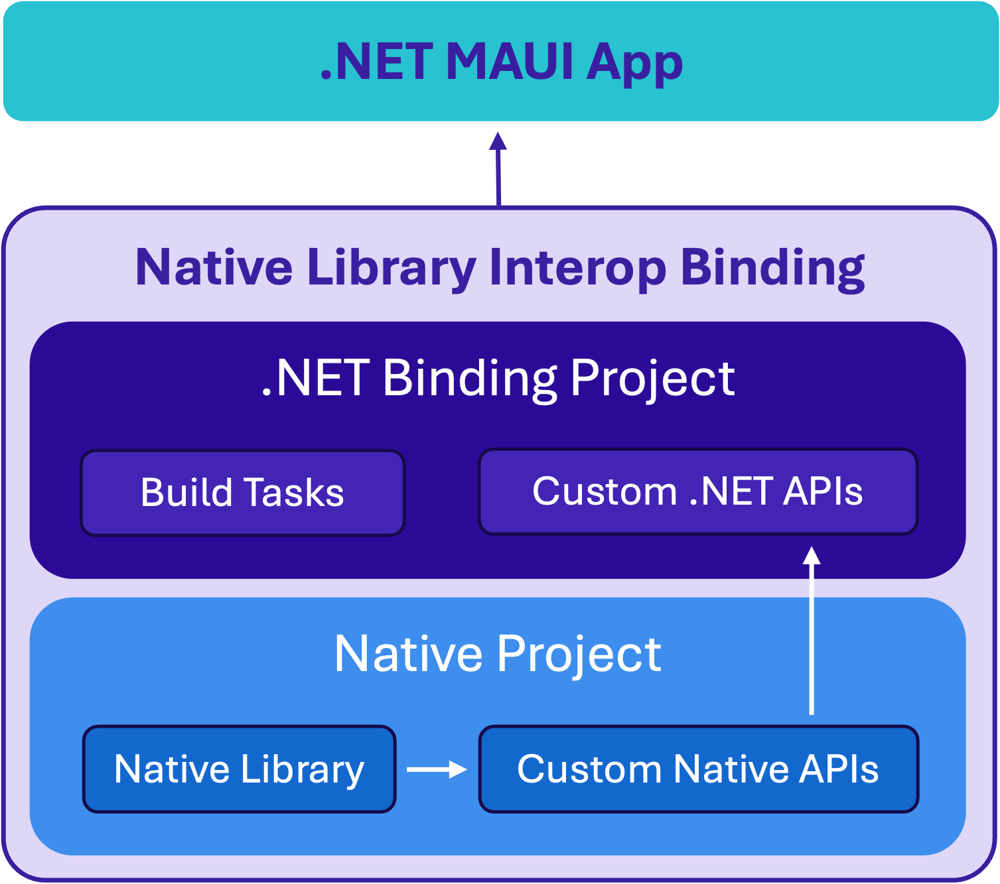

# Native Library Interop for .NET MAUI

Native Library Interop, formerly referred to as "Slim Bindings", refers to a pattern for accessing native SDKs in .NET MAUI apps, including .NET for Android, .NET for iOS, and .NET for Mac Catalyst apps. This repository provides a starting point for developers looking to get started with creating new bindings or consuming existing bindings constructed via Native Library Interop.

</a>

All Native Library Interop bindings and samples are contributed by you, our amazing .NET community, and maintained by a core set of maintainers.

## Documentation

<a href="https://learn.microsoft.com/dotnet/communitytoolkit/maui/get-started?tabs=CommunityToolkitMaui"></a>

All of the [documentation](https://learn.microsoft.com/dotnet/communitytoolkit/maui/native-library-interop) for `CommunityToolkit.Maui.NativeLibraryInterop` can be found here on [Microsoft Learn](https://learn.microsoft.com/dotnet/communitytoolkit/maui/native-library-interop):

https://learn.microsoft.com/dotnet/communitytoolkit/maui/native-library-interop

## Getting Started

### Quick Start: New binding

Create your own binding via native library interop by copying the contents of `template` and following the getting started instructions in the [documentation](https://learn.microsoft.com/dotnet/communitytoolkit/maui/native-library-interop/get-started).

### Quick Start: Facebook, Firebase, Google Cast samples

The top-level directories in this repo contains sample MaciOS and/or Android bindings for and sample .NET MAUI apps consuming specific libraries. Get started with Native Library Interop using the Facebook, Firebase Analytics, Firebase Messaging, and Google Cast samples in this repository:

1. Submodule or clone this repo.

2. Navigate to the appropriate directory for the binding you're interested in using or building from, and read the README in the relevant directory for instructions on how to build and configure in your .NET app. Make modifications as you wish. <br>
e.g. To leverage Firebase Messaging APIs on your .NET MAUI, .NET for iOS, and .NET for Mac Catalyst apps, navigate to `firebase/macios/Firebase.MaciOS.Binding`.

3. Add a project reference to your MAUI app pointing to the path where you have cloned the repo <br>
e.g. For Firebase Messaging, add to your csproj:
    ```xaml
    <ProjectReference Include="<YourPathToClonedRepo>\firebase\macios\Firebase.MaciOS.Binding\Firebase.MaciOS.Binding.csproj" />
    ```
    OR build the binding projects and consume the .dll assembly artifacts.

4. Use the binding in your .NET app! See sample usage in the `Sample` .NET MAUI apps included in each of the relevant directories.
Note: There are no plans for shipping NuGets at this time.

For more information and guidance, check out the [documentation](https://learn.microsoft.com/dotnet/communitytoolkit/maui/native-library-interop/get-started).

## Contributing

If you are interested in contributing, please **open an issue** and articulate what you wish to contribute.

There are two main ways in which you might consider contributing to this project:

1. **Expanding the API Surface for existing bindings**: Modify an existing binding in this repository by expanding its API surface and exposing more functionality that would benefit the majority of developers.
2. **Adding new bindings**: Share with the community a binding you have created for a library that is not already in this repository.

Please keep in mind that for a contribution to be considered, it:
* Must be broadly applicable and beneficial to a wide audience of .NET developers (e.g., an internal company's native SDK would not be a good candidate)
* Must align with this repository's existing structure and conventions
* May require some collaboration with maintainers to refine the API surface changes

## Resources

- [GoneMobile.io: Slim Bindings Podcast Episode](https://www.gonemobile.io/101)
- [MonkeyFest 2020: Bridge the gap with Bindings to native iOS and Android SDK's](https://www.youtube.com/watch?v=bgK_6anwMcw)

## Code of Conduct
As a part of the .NET Foundation, we have adopted the [.NET Foundation Code of Conduct](https://dotnetfoundation.org/code-of-conduct). Please familiarize yourself with that before participating with this repository. Thanks!

## .NET Foundation
This project is supported by the [.NET Foundation](https://dotnetfoundation.org).

## Acknowledgements
A special thank you to the original authors for their hard work and dedication to this project:
- [Allan Ritchie](https://github.com/aritchie)
- [Jonathan Dick](https://github.com/Redth)
- [Mike Parker](https://github.com/mikeparker104)
- [Peter Collins](https://github.com/pjcollins)

Your efforts are highly valued and appreciated! ❤️
